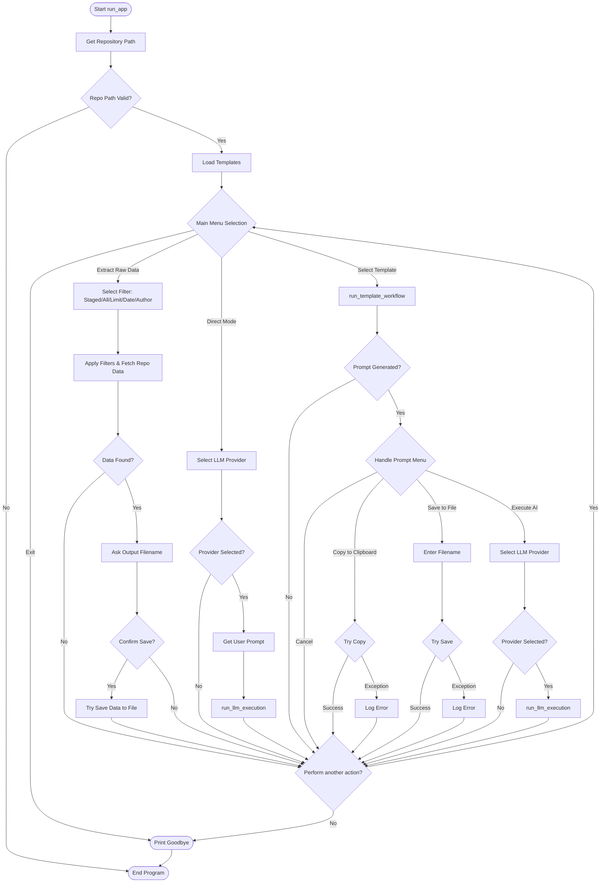

```mermaid
graph TD
    Start([Start run_app]) --> GetRepo[Get Repository Path]
    GetRepo --> RepoCheck{Repo Path Valid?}
    
    RepoCheck -- No --> End([End Program])
    RepoCheck -- Yes --> LoadTemps[Load Templates]
    LoadTemps --> MainLoop{Main Menu Selection}

    %% --- Branch 1: Exit ---
    MainLoop -- Exit --> Goodbye([Print Goodbye])
    Goodbye --> End

    %% --- Branch 2: Raw Data Extraction ---
    MainLoop -- Extract Raw Data --> FilterRaw[Select Filter: Staged/All/Limit/Date/Author]
    FilterRaw --> ApplyFilter[Apply Filters & Fetch Repo Data]
    ApplyFilter --> DataCheck{Data Found?}
    DataCheck -- No --> LoopCheck
    DataCheck -- Yes --> AskFile[Ask Output Filename]
    AskFile --> ConfirmSave{Confirm Save?}
    ConfirmSave -- Yes --> TrySaveRaw[Try Save Data to File]
    TrySaveRaw --> LoopCheck
    ConfirmSave -- No --> LoopCheck

    %% --- Branch 3: Direct Mode ---
    MainLoop -- Direct Mode --> ProvDirect[Select LLM Provider]
    ProvDirect --> ProvCheckDirect{Provider Selected?}
    ProvCheckDirect -- No --> LoopCheck
    ProvCheckDirect -- Yes --> PromptDirect[Get User Prompt]
    PromptDirect --> ExecDirect[run_llm_execution]
    ExecDirect --> LoopCheck

    %% --- Branch 4: Template Workflow ---
    MainLoop -- Select Template --> RunTempl[run_template_workflow]
    RunTempl --> TemplPrompt{Prompt Generated?}
    TemplPrompt -- No --> LoopCheck
    TemplPrompt -- Yes --> HandlePrompt{Handle Prompt Menu}

    %% Sub-branch: Cancel
    HandlePrompt -- Cancel --> LoopCheck
    
    %% Sub-branch: Clipboard
    HandlePrompt -- Copy to Clipboard --> TryCopy{Try Copy}
    TryCopy -- Success --> LoopCheck
    TryCopy -- Exception --> LogError1[Log Error]
    LogError1 --> LoopCheck

    %% Sub-branch: File
    HandlePrompt -- Save to File --> AskTemplFile[Enter Filename]
    AskTemplFile --> TrySaveT{Try Save}
    TrySaveT -- Success --> LoopCheck
    TrySaveT -- Exception --> LogError2[Log Error]
    LogError2 --> LoopCheck

    %% Sub-branch: Execute
    HandlePrompt -- Execute AI --> ProvTempl[Select LLM Provider]
    ProvTempl --> ProvCheckTempl{Provider Selected?}
    ProvCheckTempl -- Yes --> ExecTempl[run_llm_execution]
    ProvCheckTempl -- No --> LoopCheck
    ExecTempl --> LoopCheck

    %% --- Main Loop Control ---
    LoopCheck{Perform another action?}
    LoopCheck -- Yes --> MainLoop
    LoopCheck -- No --> Goodbye
```