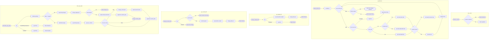

```mermaid
graph TD
    subgraph json_serial_func [json_serial]
        StartJson([Start json_serial]) --> IsDatetime{Is instance datetime?}
        IsDatetime -- Yes --> RetIso([Return isoformat])
        IsDatetime -- No --> RaiseType[Raise TypeError]
    end

    subgraph get_diff_text_func [get_diff_text]
        StartDiffText([Start get_diff_text]) --> InitDiffs[Init diffs list]
        InitDiffs --> LoopDiff{For each diff_item}
        LoopDiff -- Next --> TryDiffItem{Try Process Item}
        TryDiffItem --> CheckNew{Is new_file?}
        CheckNew -- Yes --> SetPrefixNew[Set Prefix NEW FILE]
        CheckNew -- No --> CheckDel{Is deleted_file?}
        CheckDel -- Yes --> SetPrefixDel[Set Prefix DELETED FILE]
        CheckDel -- No --> SetPrefixMod[Set Prefix FILE Path]
        
        SetPrefixNew & SetPrefixDel & SetPrefixMod --> CheckDiffContent{Has diff content?}
        CheckDiffContent -- Yes --> DecodeDiff[Decode utf-8]
        CheckDiffContent -- No --> SetDefContent[Set New file content msg]
        
        DecodeDiff & SetDefContent --> AppendDiff[Append to list]
        AppendDiff --> LoopDiff
        
        TryDiffItem -- Exception --> LogDiffErr[Log Error]
        LogDiffErr --> AppendErr[Append Error Msg] --> LoopDiff
        
        LoopDiff -- Done --> CheckList{Diffs list empty?}
        CheckList -- Yes --> RetNoChanges([Return No changes detected])
        CheckList -- No --> RetJoined([Return joined string])
    end

    subgraph get_staged_diff_func [get_staged_diff]
        StartStaged([Start get_staged_diff]) --> TryStaged{Try}
        TryStaged --> CalcIndex[repo.index.diff vs HEAD]
        CalcIndex --> CallDiffText1[Call get_diff_text]
        CallDiffText1 --> RetStaged([Return Result])
        TryStaged -- Exception --> LogStaged[Log Error]
        LogStaged --> RetNone([Return None])
    end

    subgraph get_commit_diff_func [get_commit_diff]
        StartCommitDiff([Start get_commit_diff]) --> TryCommit{Try}
        TryCommit --> CheckParents{Has Parents?}
        CheckParents -- No --> RetInitMsg([Return Initial Commit Msg])
        CheckParents -- Yes --> GetParent[Get first parent]
        GetParent --> CalcParentDiff[parent.diff vs commit]
        CalcParentDiff --> CallDiffText2[Call get_diff_text]
        CallDiffText2 --> RetCommitRes([Return Result])
        TryCommit -- Exception --> RetErrStr([Return Error String])
    end

    subgraph fetch_repo_data_func [fetch_repo_data]
        StartFetch([Start fetch_repo_data]) --> TryFetch{Try}
        TryFetch --> InitRepo[Initialize git.Repo]
        InitRepo --> CheckFilterMode{Mode == staged?}
        
        %% Staged Path
        CheckFilterMode -- Yes --> LogStagedInfo[Log Fetching Staged]
        LogStagedInfo --> CallStaged[Call get_staged_diff]
        CallStaged --> CheckStagedRes{Result Empty?}
        CheckStagedRes -- Yes --> RetEmptyList([Return Empty List])
        CheckStagedRes -- No --> CreateVirtual[Create Virtual Commit Dict]
        CreateVirtual --> AppendVirtual[Append to commits_data]
        
        %% History Path
        CheckFilterMode -- No --> BuildKwargs[Build Filter kwargs]
        BuildKwargs --> LogHist[Log Fetching History]
        LogHist --> GetCommits[repo.iter_commits]
        GetCommits --> LoopCommits{For each commit}
        LoopCommits -- Next --> CallCommitDiff[Call get_commit_diff]
        CallCommitDiff --> BuildInfo[Build commit info dict]
        BuildInfo --> AppendHist[Append to commits_data]
        AppendHist --> LoopCommits
        
        %% Returns
        AppendVirtual --> RetData([Return commits_data])
        LoopCommits -- Done --> RetData
        
        %% Exceptions
        TryFetch -- InvalidGitRepositoryError --> LogCrit1[Log Critical]
        LogCrit1 --> RaiseVal[Raise ValueError]
        TryFetch -- Exception --> LogCrit2[Log Critical]
        LogCrit2 --> RaiseE[Raise Exception]
    end
```