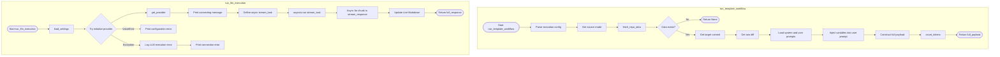

```mermaid
graph TD
    subgraph run_template_workflow
        StartWorkflow([Start run_template_workflow])
        --> ParseConfig[Parse execution config]
        --> GetSource[Get source mode]
        --> FetchData[fetch_repo_data]
        --> CheckData{Data exists?}
        CheckData -- No --> ReturnNone([Return None])
        CheckData -- Yes --> GetTarget[Get target commit]
        --> GetDiff[Get raw diff]
        --> LoadPrompts[Load system and user prompts]
        --> InjectVars[Inject variables into user prompt]
        --> ConstructPayload[Construct full payload]
        --> CountTokens[count_tokens]
        --> ReturnPayload([Return full_payload])
    end

    subgraph run_llm_execution
        StartLLM([Start run_llm_execution])
        --> LoadSettings[load_settings]
        --> TryInit{Try initialize provider}
        TryInit --> GetProvider[get_provider]
        --> PrintConnect[Print connecting message]
        --> DefineTask[Define async stream_task]
        --> AsyncRun[asyncio.run stream_task]
        --> StreamLoop[Async for chunk in stream_response]
        --> UpdateLive[Update Live Markdown]
        --> ReturnResponse([Return full_response])
        TryInit -- ValueError --> PrintConfigError[Print configuration error]
        TryInit -- Exception --> LogError[Log LLM execution error]
        --> PrintConnError[Print connection error]
    end
```