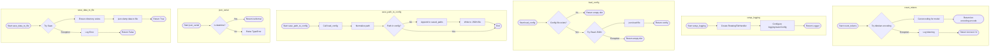

```mermaid
graph TD
    subgraph count_tokens
        CT_Start([Start count_tokens]) --> CT_Try{Try tiktoken encoding}
        CT_Try --> CT_Encode[Get encoding for model]
        CT_Encode --> CT_ReturnLen([Return len encoding.encode])
        CT_Try -- Exception --> CT_Log[Log Warning]
        CT_Log --> CT_ReturnEst([Return len text // 4])
    end

    subgraph setup_logging
        SL_Start([Start setup_logging]) --> SL_Handler[Create RotatingFileHandler]
        SL_Handler --> SL_Config[Configure logging.basicConfig]
        SL_Config --> SL_Return([Return Logger])
    end

    subgraph load_config
        LC_Start([Start load_config]) --> LC_CheckExists{Config file exists?}
        LC_CheckExists -- No --> LC_ReturnDefault([Return empty dict])
        LC_CheckExists -- Yes --> LC_Try{Try Read JSON}
        LC_Try --> LC_Read[json.load file]
        LC_Read --> LC_ReturnLoaded([Return config])
        LC_Try -- Exception --> LC_ReturnDefErr([Return empty dict])
    end

    subgraph save_path_to_config
        SPC_Start([Start save_path_to_config]) --> SPC_Load[Call load_config]
        SPC_Load --> SPC_Norm[Normalize path]
        SPC_Norm --> SPC_Check{Path in config?}
        SPC_Check -- No --> SPC_Append[Append to saved_paths]
        SPC_Append --> SPC_Write[Write to JSON file]
        SPC_Write --> SPC_End([End])
        SPC_Check -- Yes --> SPC_End
    end

    subgraph json_serial
        JS_Start([Start json_serial]) --> JS_Check{Is datetime?}
        JS_Check -- Yes --> JS_Return([Return isoformat])
        JS_Check -- No --> JS_Raise[Raise TypeError]
    end

    subgraph save_data_to_file
        SDF_Start([Start save_data_to_file]) --> SDF_Try{Try Save}
        SDF_Try --> SDF_Dirs[Ensure directory exists]
        SDF_Dirs --> SDF_Write[json.dump data to file]
        SDF_Write --> SDF_True([Return True])
        SDF_Try -- Exception --> SDF_Log[Log Error]
        SDF_Log --> SDF_False([Return False])
    end
```